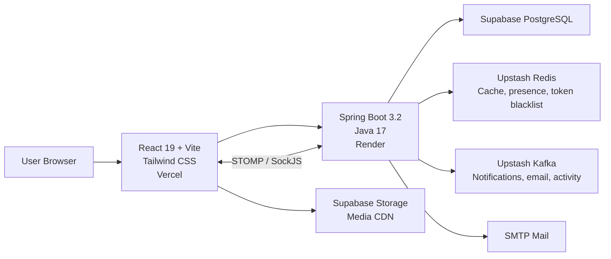

# FriendsHub

<div align="center">

  <h3>A full-stack social platform built with Spring Boot, React, Redis, Kafka, and Supabase.</h3>

  <p>
    <a href="https://www.friendshub.me"><strong>Live App</strong></a>
    |
    <a href="https://github.com/Jayanand07/Friends-Hub">Repository</a>
  </p>

  <p>
    
    
    
    
    
    
  </p>

</div>

---

## Overview

FriendsHub is a production-minded social media application with authentication, profiles, posts, stories, reactions, comments, private and group chat, real-time presence, admin moderation, media uploads, and async notification workflows.

The project is split into a Spring Boot backend and a Vite React frontend. It is designed around a managed production stack: Supabase PostgreSQL and Storage, Upstash Redis, Upstash Kafka, Render for the backend, and Vercel for the frontend.

## Product Highlights

- Secure account system with JWT authentication, email verification, password reset, and Google OAuth.
- Social feed with image posts, likes, comments, emoji reactions, user suggestions, and profile privacy.
- Stories with viewer tracking and short-lived story-oriented caching.
- Private chat and group chat over STOMP WebSockets with authenticated socket connections.
- Online presence backed by Redis TTL heartbeats.
- Async notification and email workflows using Kafka topics and retry handling.
- Admin controls for users, posts, comments, blocks, and audit logs.
- Production hardening with rate limiting, CORS controls, secure headers, resilient error handling, and actuator metrics.

## Architecture



## Tech Stack

| Area | Tools |
| --- | --- |
| Frontend | React 19, Vite, Tailwind CSS 4, React Router, Radix UI, Framer Motion, Lucide Icons |
| Backend | Java 17, Spring Boot 3.2.3, Spring Security, Spring Data JPA, Spring WebSocket |
| Database | PostgreSQL on Supabase |
| Media | Supabase Storage |
| Cache and presence | Redis / Upstash Redis |
| Async processing | Kafka / Upstash Kafka |
| Auth | JWT, BCrypt, Google OAuth, email verification |
| Monitoring | Spring Actuator, Micrometer, Prometheus endpoint |
| Deployment | Render backend, Vercel frontend, Docker-ready backend |

## Repository Structure

```text
.
+-- src/main/java/com/example/socialmedia
|   +-- config          # Security, Redis, Kafka, WebSocket, metrics, rate limiting
|   +-- controller      # REST API controllers
|   +-- dto             # Request and response payloads
|   +-- entity          # JPA entities and enums
|   +-- repository      # Spring Data JPA repositories
|   +-- security        # JWT and STOMP authentication
|   +-- service         # Business logic, storage, email, presence, notifications
+-- src/main/resources
|   +-- application.properties
+-- frontend
|   +-- src/api         # Axios API clients
|   +-- src/components  # UI, feed, stories, chat, profile components
|   +-- src/context     # Auth and theme providers
|   +-- src/pages       # App routes
|   +-- src/lib         # Supabase client
+-- docker-compose.yml    # Local Redis, Kafka, and Kafka UI
+-- Dockerfile            # Backend production image
+-- fix_rls_security.sql  # Supabase Row Level Security policies
```

## Core API Surface

| Domain | Endpoints |
| --- | --- |
| Auth | `/api/auth/register`, `/api/auth/login`, `/api/auth/verify`, `/api/auth/oauth/google`, `/api/auth/forgot-password`, `/api/auth/reset-password`, `/api/auth/refresh` |
| Posts | `/api/posts`, `/api/posts/upload-image`, `/api/posts/{postId}/like`, `/api/posts/{postId}/comment`, `/api/posts/{postId}/comments` |
| Users | `/api/users/profile`, `/api/users/{userId}`, `/api/users/{userId}/follow`, `/api/users/follow-requests`, `/api/users/suggestions`, `/api/users/blocked` |
| Stories | `/api/stories`, `/api/stories/{storyId}/view`, `/api/stories/{storyId}/viewers` |
| Chat | `/api/chat/send`, `/api/chat/history/{userId}`, `/api/chat/conversations`, `/api/chat/online` |
| Groups | `/api/chat/groups`, `/api/chat/groups/{groupId}/messages`, `/api/chat/groups/{groupId}/members` |
| Notifications | `/api/notifications`, `/api/notifications/unread-count`, `/api/notifications/mark-read` |
| Admin | `/api/admin/users`, `/api/admin/posts/{id}`, `/api/admin/comments/{id}`, `/api/admin/logs` |
| Health | `/actuator/health`, `/actuator/prometheus` |

## Local Development

### Prerequisites

- Java 17+
- Maven
- Node.js 18+
- Docker Desktop
- Supabase project for PostgreSQL and Storage

### 1. Clone the repository

```bash
git clone https://github.com/Jayanand07/Friends-Hub.git
cd Friends-Hub
```

### 2. Configure environment variables

Create backend and frontend environment files from the examples:

```bash
cp .env.example .env
cp frontend/.env.example frontend/.env
```

Set the required values for Supabase, JWT, mail, Redis, Kafka, and frontend API URL. Never commit real secrets.

### 3. Start local infrastructure

```bash
docker compose up -d
```

Local services:

| Service | URL |
| --- | --- |
| Redis | `localhost:6379` |
| Kafka | `localhost:9092` |
| Kafka UI | `http://localhost:8090` |

### 4. Run the backend

```bash
mvn spring-boot:run
```

Backend URLs:

| Purpose | URL |
| --- | --- |
| API | `http://localhost:8080/api` |
| WebSocket | `http://localhost:8080/ws` |
| Health | `http://localhost:8080/actuator/health` |
| Prometheus | `http://localhost:8080/actuator/prometheus` |

### 5. Run the frontend

```bash
cd frontend
npm install
npm run dev
```

Frontend URL: `http://localhost:5173`

## Environment Variables

### Backend

| Variable | Purpose |
| --- | --- |
| `DB_URL` | Supabase PostgreSQL JDBC URL |
| `DB_USER` | Database username |
| `DB_PASS` | Database password |
| `JWT_SECRET` | 64+ character JWT signing secret |
| `MAIL_USERNAME` | SMTP email username |
| `MAIL_PASSWORD` | SMTP email app password |
| `SUPABASE_URL` | Supabase project URL |
| `SUPABASE_KEY` | Supabase service role key for backend storage operations |
| `APP_FRONTEND_URL` | Public frontend origin for CORS and WebSocket origin checks |
| `APP_VERIFICATION_URL` | Email verification page URL |
| `APP_RESET_PASSWORD_URL` | Password reset page URL |
| `REDIS_URL` | Redis connection string |
| `KAFKA_SERVERS` | Kafka bootstrap servers |
| `KAFKA_SECURITY_PROTOCOL` | Kafka security protocol for hosted Kafka |
| `KAFKA_SASL_MECHANISM` | Kafka SASL mechanism |
| `KAFKA_SASL_JAAS_CONFIG` | Kafka SASL JAAS config |

### Frontend

| Variable | Purpose |
| --- | --- |
| `VITE_API_URL` | Backend API base URL |
| `VITE_SUPABASE_URL` | Supabase project URL |
| `VITE_SUPABASE_ANON_KEY` | Supabase anon key for client-side uploads and reads protected by RLS |

## Production Deployment

### Backend on Render

1. Create a new Web Service from this repository.
2. Use the backend root as the service root.
3. Add all backend environment variables from `.env.example`.
4. Let Render inject `PORT`; do not hardcode it.
5. Build with Maven or the included Dockerfile.

The backend reads `server.port=${PORT:8080}`, so it works both locally and on Render.

### Frontend on Vercel

1. Import the repository in Vercel.
2. Set the project root to `frontend`.
3. Add the frontend environment variables from `frontend/.env.example`.
4. Deploy with the default Vite build command:

```bash
npm run build
```

## Quality and Safety

- Stateless Spring Security with JWT.
- BCrypt password hashing.
- Token blacklist support for logout/session invalidation.
- Method-level security with role-aware endpoints.
- Sliding-window rate limiting with API visibility headers.
- Redis cache TTLs per domain: feed, posts, profiles, and stories.
- Kafka retry handling and dead-letter topic support.
- Hardened error responses with stack traces disabled.
- CORS restricted by configured frontend origin.
- Supabase RLS support via `fix_rls_security.sql`.

## Useful Commands

```bash
# Backend
mvn test
mvn spring-boot:run
mvn clean package

# Local infrastructure
docker compose up -d
docker compose down

# Frontend
cd frontend
npm install
npm run dev
npm run build
npm run lint
```

## Roadmap

- [x] Email and Google OAuth authentication
- [x] JWT-secured REST API
- [x] Posts, stories, comments, reactions, follows, blocks, and profiles
- [x] Private and group chat
- [x] Redis caching, presence, and token blacklist
- [x] Kafka-backed notifications and email jobs
- [x] Admin moderation and audit logs
- [x] Prometheus-ready actuator metrics
- [ ] AI-assisted feed ranking
- [ ] Push notifications
- [ ] End-to-end encrypted direct messages
- [ ] Mobile app companion

## Author

Built by [Jay Anand](https://github.com/Jayanand07).

If you like the project, give it a star and explore the live app at [friendshub.me](https://www.friendshub.me).
